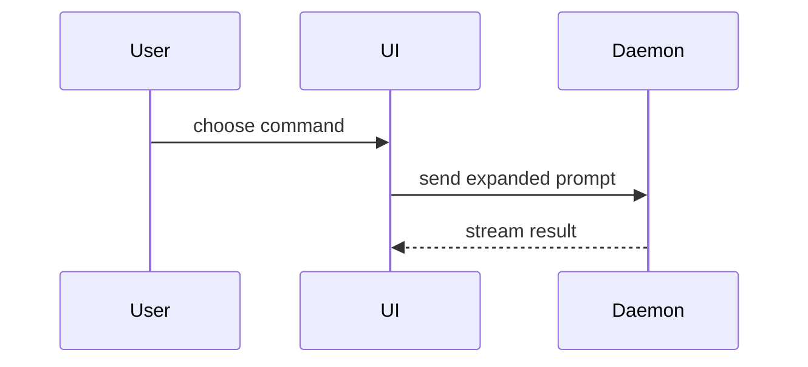

# Walkthrough 视觉表达示例

这些示例锚定表达形态，不是固定模板。替换成真实对象的名称、路径、状态和方向；只保留当前判断需要的部分。

## 逻辑与算法：伪代码

```text
on(save)
  if content is unchanged
    return cached result
  write new content
  return fresh result
```

适合解释分支、循环和状态转换。读者需要核对真实实现时，在相邻正文链接对应函数。

## 单一入口的运行路径：调用树

```text
submitForm
  createSession
    persistPrompt
    launchAgent
  navigateToSession
```

适合说明一个入口怎样逐层调用到结果；不要用它表达多参与方之间来回发生的时序。

## 所有权与嵌套：组件树或浅文件树

```tsx
<SessionPage> (apps/example/src/routes/session.tsx)
  useSessionEvents()
  <SessionToolbar>
    <RunSkillButton> (packages/ui)
```

```text
src/
├── commands/       # 解析用户动作
├── sessions/       # 持有会话状态
└── transport/      # 发送 API 请求
```

组件树强调运行时组合与模块边界；文件树强调静态责任。不要为了完整而展开无关兄弟节点。

## 多参与方时序或数据流：Mermaid



参与方、方向或先后顺序是结论的一部分时使用。只有一个调用链时，调用树通常更小。

## 已有形状上的变化：结构化 diff

```diff
 on(save)
-  write content
+  if content is unchanged
+    return cached result
+  write new content
+  invalidate cache
```

diff 的形状跟随对象：组件变化用组件树 diff，责任变化用文件树 diff，调用变化用调用树 diff。多数内容全新、删减上下文会隐藏所有权或执行顺序时，改为展示完整块。

## 完整的新形状：可复制代码块

```ts
function expandSkill(command: string): string {
  const skillName = command.slice(1)
  return `use the ${skillName} skill`
}
```

只在读者需要完整目标形态或可复制实现时使用；Walkthrough 仍要在相邻正文说明它为什么位于这里、由谁调用、证据支持到哪里。

## 超出文本图能力：聚焦 HTML

界面布局、交互状态对照或高密度概念确实需要空间关系和交互时，创建一个自包含、桌面与移动端都可读的 HTML 图解，并打开给用户。只做当前判断需要的一张图、信息图或短页组；使用真实标签和数据，不把普通调用链包装成网页。
